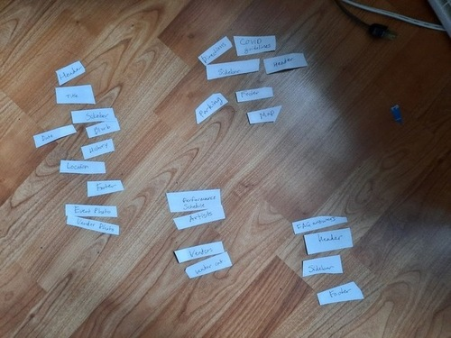
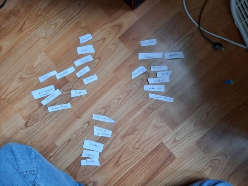
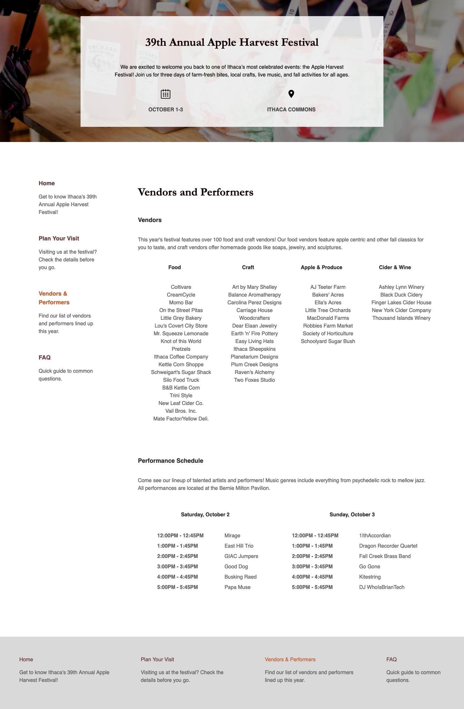

# Ithaca Apple Harvest Festival

A redesign of Ithaca's Annual Apple Harvest Festival [site](https://www.downtownithaca.com/apple-harvest-festival/), as an exercise of user-centered design.

**Jump to the finished [site screenshots](#user-testing
) for a visual preview.**

## Table of Contents

[Understanding Users](#understanding-users)

[Content Planning](#content-planning)

[Information Architecture](#information-architecture)

[Visual Theme](#visual-theme)

[Design](#design)

[User Testing](#user-testing)

[Self-Reflection](#self-reflection)

## Understanding Users

The redesigned site's target audience is local parents of K-12 students in Ithaca. Selecting a specific group ensures that our audience has similar goals and will be cohesive.

Parents might be more interested in similar entertainment options, child-friendly group activities, et cetera. As locals, they might also be more interested in specific vendors and crafters that they haven't seen before.

### User Interview Questions
A transcript of the questions used when interviewing audience members.

>1. Please tell me a bit about yourself. You may omit any personal or private information.
>2. What made you want to attend AppleFest last weekend？
>3. Before you went to the festival, did you search for any details or information about it online?
>4. When you arrived at the festival location, did you search for any details or information about the festival online?
>5. When you were in the process of exploring the festival, did try to find any information  or details about the festival?
>6. Is there any information you wish you had known about the festival beforehand or information that you weren't able to find?
>7. What was the most useful piece of information that you found online about AppleFest?
>8. Did you visit AppleFest with your child(ren)? Was there anything you had to plan differently when going with them, compared to going on your own?
>9. Have you been to AppleFest before? If you have, how was your most recent visit different from  visits in the past?

**Users Selected:**
1. Local USPS mailman with a son in middle school. Works irregular schedule.

2. New Ithaca resident, female Cornell employee. Two sons in elementary school.

3. Ithaca local, 2 daughters, immigrant small business owner.

### Goals

Analysis of audience goals:

**Goal 1:** Find a good time to visit, not too crowded or empty. Many interviewees expressed that visiting on Saturday resulted in longer waits, while some vendors didn't attend on Sunday.

**Goal 2:** Plan what to eat after event, as there were fewer options for real food at the festival.

**Goal 3:** View specific vendors beforehand, to see if any vendors from previous years would attend, and preview the selection of foods/drinks/crafts.

## Content Planning
Text and media content included in the redesigned site.

### Planned Content

- Hours/days that event is open
- Performance/event schedule
- Artist lineup
- Map of the Commons
- Parking information
- List of vendors w/ categories
- COVID guidelines
- Title
- Photos of event
- PHotos of vendors and items
- FAQ's about event
- Background info blurb

### Content Justification

 The content is heavily based around allowing visitors to plan ahead, and experience the festival efficiently.

 The users I spoke with all work full time, and expressed similar feelings of wanting to spend quality time with kids, but having limited time or availability.

 The information allows parents to plan the day in advance, and navigate the event efficiently.

## Information Architecture
### Content Organization

#### Iteration 1

This configuration includes 4 pages - one for performance and vendor, which are the main attractions, one for information about guidelines and possibly useful details for planning the actual trip, a FAQ page, and a home page with more photos and trivia information about the event.

#### Iteration 2

3 pages - one designated for vendors, since that was a major need expressed by the audience.

The home page includes more time-sensitive information like event hours, performance schedules, etc., are combined into one page, since they vary from day to day.

FAQs and other technical planning details like parking are in one page, since they're less interest-based and more need-based.

#### Iteration 3

Same as iteration 2 - the home page includes more time-sensitive information like event hours, performance schedules, etc., are combined into one page, since they vary from day to day. COVID guidelines are in FAQs, since they aren't strict requirements, and may only be important to extra COVID-cautious visitors.

Vendors are included with other planning details, so visitors can select which vendors to visit while planning the itinerary.

**Final Content Organization**

1. Home
- Title
- Header with blurb and date/location
- Photos of event
- Callout/announcement
- Hours/days that event is open
- COVID guidelines
- Sidebar menu
- Footer menu

2. Performers and vendors
- Header with blurb and date/location
- Performance/event schedule
- Performance timetable
- Artists performing at event
- List of vendors w/categories
- Sidebar menu
- Footer

3. Planning your visit
- Header with blurb and date/location
- Map of event
- directions
- Parking information
- Public Transit
- Sidebar menu
- Footer menu

4. FAQ
- Header with blurb and date/location
- list of questions
- list of answers
- links to other resources
- Sidebar menu
- Footer menu

### Final Content Organization

The final iteration will be used. It minimizes the number of pages while still keeping the content clearly organized by the purpose it will help the audience achieve.

The users I interviewed had different needs when it came to planning - some were interested in having the best experience by finding their preferred festival food, vendors, and events beforehand. Others were interested in finding detailed information about accommodations to prevent stressful situations. For example, finding bathrooms, or finding specific vendors so they wouldn't be stuck in line for a long time.

### Navigation

**Site Pages**
- Home
- Vendors and Performers
- Plan Your Visit
- FAQ

The home page includes a rundown of the event and what it is, and the most general but important information will be listed here (hours, dates). It includes information that anyone interested in visiting would be likely to need like the date/hours and location.

The Vendors and Performers page lists detailed information about what can be purchased, consumed, or viewed at the festival. This allows the visitor to plan around what they're interested in.

The Plan Your Visit includes logistical information, and allows users to plan around factors like how to get there, places to rest or explore after the festival, parking information, and public transit information.

## Visual Theme

- Sans-serif body
- Red/brown accent colors
- Uniform font family throughout, serifs for header
- Aligned sharp edges

I selected a visual theme with fewer attention grabbing design choices (such as bright colors, bold fonts, large images) because my audience is using the site to plan, and have presumably already decided to attend.

It gives a more utilitarian feel, as I want users to be able to find important information easily, rather than be distracted by attention-grabbing elements.

## Design

Documenting the site's layout.ion of things like timetables.

### Final Design (Milestone 1)

**Mobile Design:**

The header, footer, and navigation menu are uniform throughout the 4 pages. In index, all content spans the device width. In Vendors, performers and times are separated into 2 columns. Image content also spans the device width, and captions are placed below.

The navigation menu items are stacked in a single column.

**Desktop Design:**

The header, footer, and navigation menu are uniform throughout the 4 pages. The footer has a row of navigation links, and the sidebar arranges the menu items in a column. The header has a background image with a box overlay containing main details like the site title, event date, and event location.

In the Vendors page, each category is its own box, and all categories are displayed in a single row. The sidebar menu has less width than the main page content.

## User Testing

### Finished Desktop & Mobile Website

Screenshots of both the desktop and mobile version of your site used for user testing.

**Mobile Screenshots:**

#### Home

#### Plan Your Visit

#### Vendors

#### FAQ

**Desktop Screenshots:**
#### Home

#### Plan Your Visit

#### Vendors

#### FAQ

### User Testing Tasks

1. You attended Applefest a few years back and remember trying some tasty kettle corn from B&B Kettle Corn. Find out if they'll be at the festival again this year.

2. You arrived at Applefest and realized that you forgot to bring cash. Find out if vendors here accept credit card.

### User 1 (Final Submission)

**Task 1:** You attended Applefest a few years back and remember trying some tasty kettle corn from B&B Kettle Corn. Find out if they'll be at the festival again this year.

- **Was desktop or mobile design used for testing?**
  - Desktop
- **How did the user do?**
  - They spent a lot more time reading the text content than I expected. I previously thought they would just skim through irrelevant sections.
- **User’s reaction to the design**
  - They found the vendors page to be difficult to read, and commented on the long list.
  - They were a bit hesitant on clicking to different pages, and scrolled a few times to make sure they were clicking correctly.
  - Got stuck at the very end because there were multiple kettle corn vendors.
- **Reflection**
  - He was a bit hesitant and I think it may have been because I was watching and taking notes. He seemed deliberate, and read everything carefully before clicking. I don't know if he would have responded the same if he were using the site alone, since he also considered clicking the other pages (Plan Your Visit).
  - Content is also important for user friendly sites. He was unable to find the kettle corn vendor provided since he thought there would only be one, and also because the list wasn't alphabetical.
- **Re-design choices**
  - Alphabetize long text lists, reduce or shorten unnecessary text. Add more spacing between vendor category items, use larger or bolder font. Possibly split list into subsections.
- **Additional Notes**
  - The lighter color, and having all the text bunched up, makes it much harder to find a single item from the list. Alphabetizing makes it easier to find specific vendors if you know their name.

**Task 2:** You arrived at Applefest and realized that you forgot to bring cash. Find out if vendors here accept credit card.

- **Was desktop or mobile design used for testing?**
  - Desktop
- **How did the user do?**
  - Went through pages more quickly this time to solve task, did well/met expectations
- **User’s reaction to the design**
  - Confused why vendor info was not on vendor page. Didn't know what info was in FAQ page.
- **Reflection**
  - Much quicker now that he was familiar with the site
  - Had different assumptions for how information would be categorized than I did, assumed FAQ info would be in their respective pages
- **Re-design choices**
  - Change navigation item descriptions to reflect what's in each page. Reorder navigation to prioritize FAQ. Have preview on top of page indicating what's in the page?
- **Additional Notes**
  - The current descriptions for nav items is not enough, so users should either know what's in a page before they click, or immediately after. Not sure if faster task completion reflects user friendliness.

### User 2

**Task 1:** You attended Applefest a few years back and remember trying some tasty kettle corn from B&B Kettle Corn. Find out if they'll be at the festival again this year.

-  **Was desktop or mobile design used for testing?**
  - Desktop
- **How did the user do?**
  - He did really well, and found information that he considered useful for future trips to Applefest as well. He was able to complete tasks quickly, and navigate through the site without guidance.
- **User’s reaction to the design**
  - Navigating between pages made him jump back to the top of the page each time, and spend more time scrolling. He tried clicking on some items that weren't meant to be clickable (photos, icons).
- **Reflection**
  - He was able to use the site to effectively complete the task, but there were still confusing aspects for him (icons were not clickable). Although he completed tasks quickly, he also clicked around/did a lot of unnecessary actions that took up time.
  - He also spent a while looking through the list for the specific B&B Kettle Corn vendor
- **Re-design choices**
  - Have icons link to relevant pages (date to index page with timetable, location to plan page with map)
  - Use larger fonts with more spacing between lines, or subcategorize vendors within each category
- **Additional Notes**
  - Subcategories help in the case of having multiple vendors selling similar things (kettle corn). Icons refer to content that's already on the site, so it would be helpful to link them to those pieces of content.

  -  **Was desktop or mobile design used for testing?**
      - Desktop
  - **How did the user do?**
    - They were able to complete the task very quickly since they saw the question in the FAQ during the task earlier.
  - **User’s reaction to the design**
    - FAQs aren't categorized, so he didn't know where exactly the question and answer were.
  - **Reflection**
    - Was able to use site to complete tasks, but he suggested that this task may not be realistic.
    - Key information should be highlighted. He read the answer and jumped to the previous question in the FAQs, since it said to bring some money, but didn't specify.
  - **Re-design choices**
    - Condense FAQ questions or make them more concise, change color or weight of important info in the answers.
  - **Additional Notes**
    - FAQ's are not organized currently, but user was able to find it quickly since the credit card question was close to the top.

### User 3

**Task 1:** You attended Applefest a few years back and remember trying some tasty kettle corn from B&B Kettle Corn. Find out if they'll be at the festival again this year.

- **Was desktop or mobile design used for testing?**
  - Mobile
- **How did the user do?**
  - They took much longer to complete the task. The vertical format made the lists of vendors harder to skim, and she had to scroll more aggressively. She was able to complete the task.
- **User’s reaction to the design**
  - Having long columns prevented her from reading stuff at the bottom/below the lists
  - Was frustrated at length of vendor page
- **Reflection**
  - Took a while to complete, was confused about navigation - not sure if she knew top and bottom/footer navigation was the same.
- **Re-design choices**
  - Use two columns for long columns to break up content, make sure user can easily see each section when skimming.
- **Additional Notes**
  - Two columns help reduce whitespace, the names of vendors are fairly short so it won't cause horizontal scrolling.

**Task 2:** You arrived at Applefest and realized that you forgot to bring cash. Find out if vendors here accept credit card.

- **Was desktop or mobile design used for testing?**
  - Mobile
- **How did the user do?**
  - Task was completed, but caused frustration. Took much longer to complete, may be impractical when trying to find this information in real time at the festival.

- **User’s reaction to the design**
  - Confused by navigation, having to scroll extensively to reach navigation menu. Disoriented.
- **Reflection**
  - I'm not sure if she would have completed the task alone, if she didn't feel pressured to because I was taking notes.
- **Re-design choices**
  - Add links to break the scrolling periodically, so user doesn't have to go all the way to the top or bottom to switch pages.
- **Additional Notes**
  - Helps to minimize physical motion when navigation, but also have to keep content organized and not too cluttered.

### Potential Changes Based on User Testing
- Size up and darken the font in the vendor list.
- Reorder content so some FAQ's are placed in relevant pages, or linked in relevant points.
-  Break up large chunks of text content on mobile.
- Add more photos of event (users suggested)
- If list of items is unordered, add subcategories so users can skim more easily.

## Self-Reflection

People have very different responses to the same designs, and it's easy to be biased as the designer

I know the site and content well, but the user doesn't. I was surprised at how long the users to complete the task most of the time, but then realized that it's because I've used/browsed through the site dozens of times in the process of designing it.
